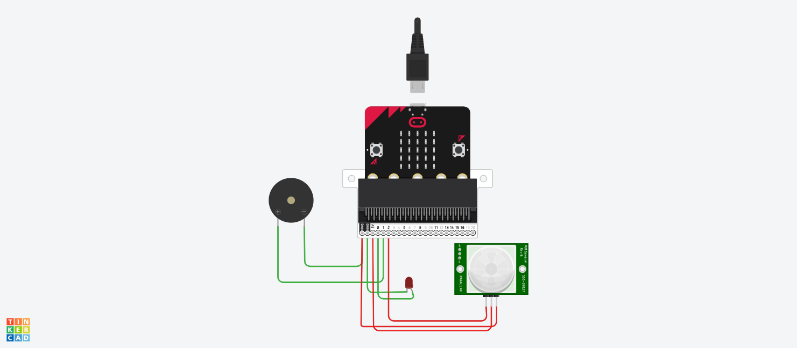

# microbit-security-system
security system

# overview
more than 2.3 million robberyt happen yearly and to protect ourselves and our precious stuff we need a security system to protect us and that is where this system comes , using IR sensor , a led , a buzzer , microbit and it's shield I made a security system with python language that detects infrared radiation from moving objects , people and animals or anything that could cause danger to our stuff

# Tools

 

use the micropython 1.19.1 and connect it to the shield

### inputs ( if you will use the exact code)

connect *pin2* to the IR sensor  

### outputs ( if you will use the exact code)

connect *pin0* to the led

connect *pin1* to the buzzer 

```
while True :
    if pin2.read_digital==1:
        pin1.write_digital(1)
        pin0.write_digital(1)
        # if the IR sensed some movment the reading will be 1 and the buzzer and led will turn on 
    elif pin2.read_digital==0:
        pin1.write_digital(0)
        pin0.write_digital(0)
        # if the IR sesnsor does not sense any movment it won't turn on and will stay off 

```
